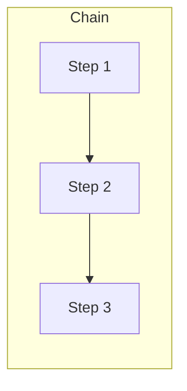
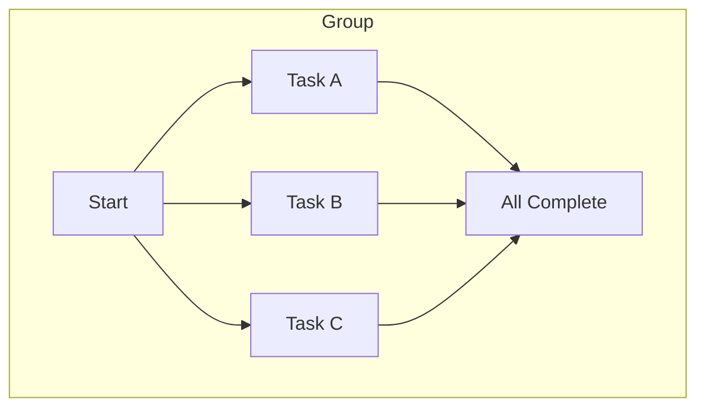

# OJS Java SDK

[](https://github.com/openjobspec/ojs-java-sdk/actions/workflows/ci.yml)
[](https://github.com/openjobspec/ojs-java-sdk/actions/workflows/ci.yml)
[](https://opensource.org/licenses/Apache-2.0)
[](https://openjdk.org/projects/jdk/21/)

Official [Open Job Spec](https://openjobspec.org) SDK for Java 21+.

> **🚀 Try it now:** [Open in Playground](https://playground.openjobspec.org?lang=java) · [Run on CodeSandbox](https://codesandbox.io/p/sandbox/openjobspec-java-quickstart) · [Docker Quickstart](https://github.com/openjobspec/openjobspec/blob/main/docker-compose.quickstart.yml)

## Features

- **Java 21+** -- records, sealed interfaces, virtual threads (Project Loom)
- **Zero dependencies** -- uses only `java.net.http.HttpClient` from the standard library
- **Optional Jackson support** -- Jackson annotations on types for enhanced JSON serialization
- **Builder pattern** -- fluent builders for all configuration
- **Virtual threads** -- concurrent worker execution with Project Loom
- **Full OJS support** -- enqueue, workers, middleware, workflows (chain/group/batch)

## Installation

### Maven

```xml
<dependency>
    <groupId>org.openjobspec</groupId>
    <artifactId>ojs-sdk</artifactId>
    <version>0.1.0</version>
</dependency>
```

### Gradle

```kotlin
implementation("org.openjobspec:ojs-sdk:0.1.0")
```

## Quick Start

### Client (Producer)

```java
import org.openjobspec.ojs.*;
import java.time.Duration;
import java.util.*;

var client = OJSClient.builder()
    .url("http://localhost:8080")
    .build();

// Simple enqueue
var job = client.enqueue("email.send", Map.of("to", "user@example.com"));

// Enqueue with options
var job = client.enqueue("report.generate", (Object) Map.of("id", 42))
    .queue("reports")
    .delay(Duration.ofMinutes(5))
    .retry(RetryPolicy.builder().maxAttempts(5).build())
    .unique(UniquePolicy.builder()
        .key(List.of("id"))
        .period(Duration.ofHours(1))
        .build())
    .send();
```

### Worker (Consumer)

```java
var worker = OJSWorker.builder()
    .url("http://localhost:8080")
    .queues(List.of("default", "email"))
    .concurrency(10)
    .build();

worker.register("email.send", ctx -> {
    var to = (String) ctx.job().argsMap().get("to");
    sendEmail(to);
    return Map.of("messageId", "...");
});

// Middleware
worker.use((ctx, next) -> {
    System.out.printf("Processing %s%n", ctx.job().type());
    var start = Instant.now();
    next.handle(ctx);
    System.out.printf("Done in %dms%n",
        Duration.between(start, Instant.now()).toMillis());
});

// Graceful shutdown
Runtime.getRuntime().addShutdownHook(new Thread(worker::stop));
worker.start();
```

### Workflows

OJS provides three workflow primitives — **chain** (sequential), **group** (parallel fan-out/fan-in), and **batch** (parallel with callbacks):




```java
// Chain (sequential)
var chain = Workflow.chain("order-processing",
    Workflow.step("order.validate", Map.of("order_id", "ord_123")),
    Workflow.step("payment.charge", Map.of()),
    Workflow.step("notification.send", Map.of())
);
client.createWorkflow(chain);

// Group (parallel)
var group = Workflow.group("multi-export",
    Workflow.step("export.csv", Map.of("report_id", "rpt_456")),
    Workflow.step("export.pdf", Map.of("report_id", "rpt_456"))
);
client.createWorkflow(group);

// Batch (parallel with callbacks)
var batch = Workflow.batch("bulk-email",
    Workflow.callbacks()
        .onComplete(Workflow.step("batch.report", Map.of()))
        .onFailure(Workflow.step("batch.alert", Map.of())),
    Workflow.step("email.send", Map.of("to", "user1@example.com")),
    Workflow.step("email.send", Map.of("to", "user2@example.com"))
);
client.createWorkflow(batch);
```

## API Reference

### Core Types

| Type | Description |
|------|-------------|
| `Job` | Job envelope record with all OJS attributes |
| `RetryPolicy` | Retry configuration (max attempts, backoff, jitter) |
| `UniquePolicy` | Deduplication policy (key, period, conflict resolution) |
| `JobContext` | Context passed to handlers (job, result, heartbeat) |
| `JobHandler` | `@FunctionalInterface` for job processing |
| `Middleware` | `@FunctionalInterface` for execution middleware |
| `OJSError` | Sealed interface hierarchy for structured errors |
| `Workflow` | Chain, group, and batch workflow builders |

### Client Operations

| Method | Description |
|--------|-------------|
| `enqueue(type, args)` | Enqueue a job immediately |
| `enqueue(type, args).queue().send()` | Enqueue with options |
| `enqueueBatch(requests)` | Atomic batch enqueue |
| `getJob(id)` | Get job by ID |
| `cancelJob(id)` | Cancel a job |
| `health()` | Server health check |
| `createWorkflow(definition)` | Create a workflow |
| `getWorkflow(id)` | Get workflow status |

### Worker Configuration

| Option | Default | Description |
|--------|---------|-------------|
| `url` | required | OJS server URL |
| `queues` | `["default"]` | Queues to process (priority order) |
| `concurrency` | `10` | Max concurrent jobs |
| `gracePeriod` | `25s` | Shutdown grace period |
| `heartbeatInterval` | `5s` | Heartbeat frequency |
| `pollInterval` | `1s` | Polling frequency when idle |

## JSON Serialization

The SDK includes a **built-in JSON parser** (zero dependencies) that handles all OJS types out of the box. No additional libraries are required.

### Built-in Parser (Default)

The built-in parser uses `java.net.http.HttpClient` and supports all OJS types (Job, RetryPolicy, UniquePolicy, Workflow, etc.) with safety limits (max depth 128, max input 10 MB).

```java
// Works out of the box — no Jackson needed
var client = OJSClient.builder()
    .url("http://localhost:8080")
    .build();

var job = client.enqueue("email.send", Map.of("to", "user@example.com"));
```

### Optional Jackson Support

If your project already uses Jackson, the SDK types include Jackson annotations (`@JsonProperty`, `@JsonCreator`) for seamless integration with your existing serialization pipeline. To use Jackson, add it as a dependency alongside the SDK:

```xml
<dependency>
    <groupId>com.fasterxml.jackson.core</groupId>
    <artifactId>jackson-databind</artifactId>
    <version>2.17.0</version>
</dependency>
```

**When to use which:**
- **Built-in parser** (default): Lightweight projects, microservices, or when minimizing dependencies.
- **Jackson**: When your project already uses Jackson, or when you need custom serialization (e.g., date formats, naming strategies, mixins).

## Real-Time Subscriptions

Subscribe to job state changes via Server-Sent Events (SSE):

```java
// Subscribe to all events
client.subscribe(event -> {
    System.out.printf("Job %s: %s → %s%n",
        event.jobId(), event.from(), event.to());
});

// Subscribe to a specific job
client.subscribeJob(jobId, event -> { /* ... */ });

// Subscribe to a queue
client.subscribeQueue("emails", event -> { /* ... */ });
```

## Building

```bash
# Maven
mvn clean package

# Gradle
gradle build
```

## License

Apache 2.0


